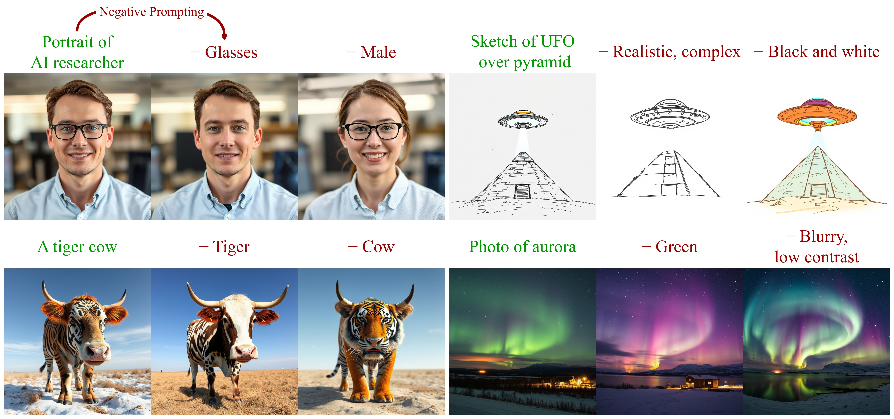

# Normalized Attention Guidance: Universal Negative Guidance for Diffusion Models

[](https://huggingface.co/spaces/ChenDY/NAG_wan2-1-fast)
[](https://chendaryen.github.io/NAG.github.io/)
[](https://arxiv.org/abs/2505.21179)
[](https://badges.toozhao.com/stats/01JWNDV5JQ2XT69RCZ5KQBCY0E "Get your own page views count badge on badges.toozhao.com")



Negative prompting on 4-step Flux-Schnell:
CFG fails in few-step models. NAG restores effective negative prompting, enabling direct suppression of visual, semantic, and stylistic attributes, such as ``glasses``, ``tiger``, ``realistic``, or ``blurry``. This enhances controllability and expands creative freedom across composition, style, and quality—including prompt-based debiasing.


## News

**2025-06-28:** 🎉 Our [ComfyUI implementation](https://github.com/ChenDarYen/ComfyUI-NAG) now supports `Flux Kontext`, `Wan2.1`, and `Hunyuan Video`!

**2025-06-24:** 🎉 A [ComfyUI node](https://github.com/kijai/ComfyUI-KJNodes/blob/f7eb33abc80a2aded1b46dff0dd14d07856a7d50/nodes/model_optimization_nodes.py#L1568) for Wan is now available! Big thanks to [Kijai](https://github.com/kijai)!

**2025-06-24:** 🤗 Demo for [LTX Video Fast](https://huggingface.co/spaces/ChenDY/NAG_ltx-video-distilled) is now available!

**2025-06-22:** 🚀 SD3.5 pipeline is released!

**2025-06-22:** 🎉 Play with the [ComfyUI implementation](https://github.com/ChenDarYen/ComfyUI-NAG) now!

**2025-06-19:** 🚀 Wan2.1 and the SDXL pipeline are released!

**2025-06-09:** 🤗 Demo for [4-step Wan2.1 with CausVid](https://huggingface.co/spaces/ChenDY/NAG_wan2-1-fast) video generation is now available!

**2025-06-01:** 🤗 Demo for [Flux-Schnell](https://huggingface.co/spaces/ChenDY/NAG_FLUX.1-schnell) and [Flux-Dev](https://huggingface.co/spaces/ChenDY/NAG_FLUX.1-dev) are now available!


## Approach

The prevailing approach to diffusion model control, Classifier-Free Guidance (CFG), enables negative guidance by extrapolating between positive and negative conditional outputs at each denoising step. However, in few-step regimes, CFG's assumption of consistent structure between diffusion branches breaks down, as these branches diverge dramatically at early steps. This divergence causes severe artifacts rather than controlled guidance.

Normalized Attention Guidance (NAG) operates in attention space by extrapolating positive and negative features Z<sup>+</sup> and Z<sup>-</sup>, followed by L1-based normalization and α-blending. This constrains feature deviation, suppresses out-of-manifold drift, and achieves stable, controllable guidance.


## Usage

### Flux
You can try NAG in `flux_nag_demo.ipynb`, or 🤗 Hugging Face Demo for [Flux-Schell](https://huggingface.co/spaces/ChenDY/NAG_FLUX.1-schnell) and [Flux-Dev](https://huggingface.co/spaces/ChenDY/NAG_FLUX.1-dev)!

Loading Custom Pipeline:

```python
import torch
from src.pipeline_flux_nag import NAGFluxPipeline
from src.transformer_flux import NAGFluxTransformer2DModel


transformer = NAGFluxTransformer2DModel.from_pretrained(
    "black-forest-labs/FLUX.1-schnell",
    subfolder="transformer",
    torch_dtype=torch.bfloat16,
    token="hf_token",
)
pipe = NAGFluxPipeline.from_pretrained(
    "black-forest-labs/FLUX.1-schnell",
    transformer=transformer,
    torch_dtype=torch.bfloat16,
    token="hf_token",
)
pipe.to("cuda")
```

Sampling with NAG:

```python
prompt = "Portrait of AI researcher."
nag_negative_prompt = "Glasses."
# prompt = "A baby phoenix made of fire and flames is born from the smoking ashes."
# nag_negative_prompt = "Low resolution, blurry, lack of details, illustration, cartoon, painting."

image = pipe(
    prompt,
    nag_negative_prompt=nag_negative_prompt,
    guidance_scale=0.0,
    nag_scale=5.0,
    num_inference_steps=4,
    max_sequence_length=256,
).images[0]
```

### Wan2.1

```python
import torch
from diffusers import AutoencoderKLWan, UniPCMultistepScheduler
from src.transformer_wan_nag import NagWanTransformer3DModel
from src.pipeline_wan_nag import NAGWanPipeline

model_id = "Wan-AI/Wan2.1-T2V-14B-Diffusers"
vae = AutoencoderKLWan.from_pretrained(model_id, subfolder="vae", torch_dtype=torch.float32)
transformer = NagWanTransformer3DModel.from_pretrained(model_id, subfolder="transformer", torch_dtype=torch.bfloat16)
pipe = NAGWanPipeline.from_pretrained(
    model_id,
    vae=vae,
    transformer=transformer,
    torch_dtype=torch.bfloat16,
)
pipe.scheduler = UniPCMultistepScheduler.from_config(pipe.scheduler.config, flow_shift=5.0)
pipe.to("cuda")

prompt = "An origami fox running in the forest. The fox is made of polygons. speed and passion. realistic."
negative_prompt = "Bright tones, overexposed, static, blurred details, subtitles, style, works, paintings, images, static, overall gray, worst quality, low quality, JPEG compression residue, ugly, incomplete, extra fingers, poorly drawn hands, poorly drawn faces, deformed, disfigured, misshapen limbs, fused fingers, still picture, messy background, three legs, many people in the background, walking backwards"
nag_negative_prompt = "static, low resolution, blurry"

output = pipe(
    prompt=prompt,
    negative_prompt=negative_prompt,
    nag_negative_prompt=nag_negative_prompt,
    guidance_scale=5.0,
    nag_scale=9,
    height=480,
    width=832,
    num_inference_steps=25,
    num_frames=81,
).frames[0]
```

For 4-step inference with CausVid, please refer to the [demo](https://huggingface.co/spaces/ChenDY/NAG_wan2-1-fast/blob/main/app.py).

### SD3.5

```python
import torch
from src.pipeline_sd3_nag import NAGStableDiffusion3Pipeline

model_id = "stabilityai/stable-diffusion-3.5-large-turbo"
pipe = NAGStableDiffusion3Pipeline.from_pretrained(
    model_id,
    torch_dtype=torch.bfloat16,
    token="hf_token",
)
pipe.to("cuda")

prompt = "A beautiful cyborg"
nag_negative_prompt = "robot"

image = pipe(
    prompt,
    nag_negative_prompt=nag_negative_prompt,
    guidance_scale=0.,
    nag_scale=5,
    num_inference_steps=8,
).images[0]
```

### SDXL

```python
import torch
from diffusers import UNet2DConditionModel, LCMScheduler
from huggingface_hub import hf_hub_download
from src.pipeline_sdxl_nag import NAGStableDiffusionXLPipeline

base_model_id = "stabilityai/stable-diffusion-xl-base-1.0"
repo_name = "tianweiy/DMD2"
ckpt_name = "dmd2_sdxl_4step_unet_fp16.bin"

unet = UNet2DConditionModel.from_config(base_model_id, subfolder="unet").to("cuda", torch.bfloat16)
unet.load_state_dict(torch.load(hf_hub_download(repo_name, ckpt_name), map_location="cuda"))
pipe = NAGStableDiffusionXLPipeline.from_pretrained(
    base_model_id,
    unet=unet,
    torch_dtype=torch.bfloat16,
    variant="fp16",
).to("cuda")
pipe.scheduler = LCMScheduler.from_config(pipe.scheduler.config, original_inference_steps=4)

prompt = "A beautiful cyborg"
nag_negative_prompt = "robot"

image = pipe(
    prompt,
    nag_negative_prompt=nag_negative_prompt,
    guidance_scale=0,
    nag_scale=3,
    num_inference_steps=4,
).images[0]
```

## Citation 

If you find NAG is useful or relevant to your research, please kindly cite our work:

```bib
@article{chen2025normalizedattentionguidanceuniversal,
    title={Normalized Attention Guidance: Universal Negative Guidance for Diffusion Model}, 
    author={Dar-Yen Chen and Hmrishav Bandyopadhyay and Kai Zou and Yi-Zhe Song},
    journal={arXiv preprint arxiv:2505.21179},
    year={2025}
}
```

