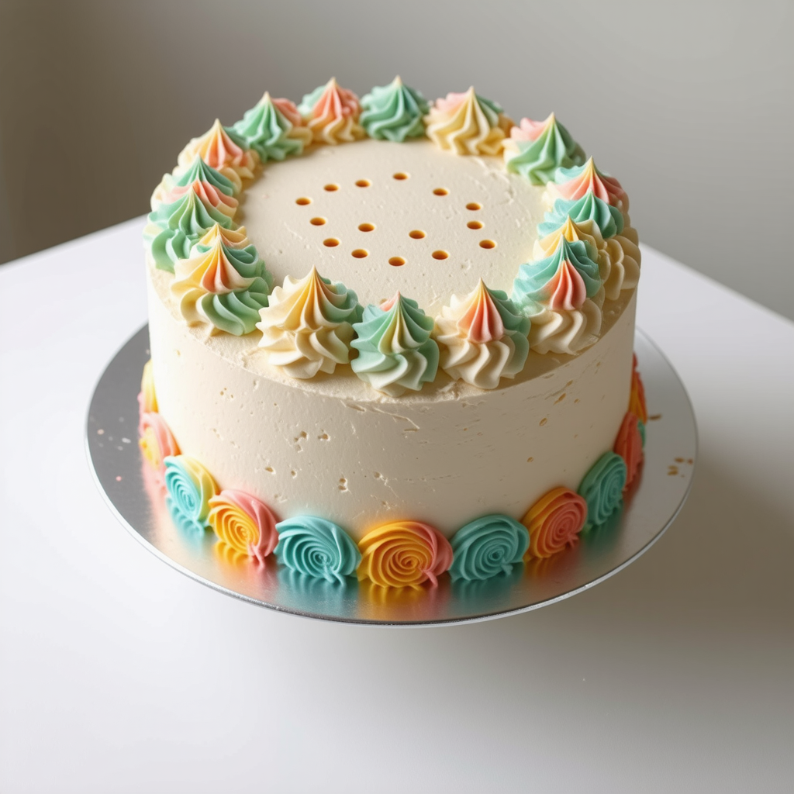
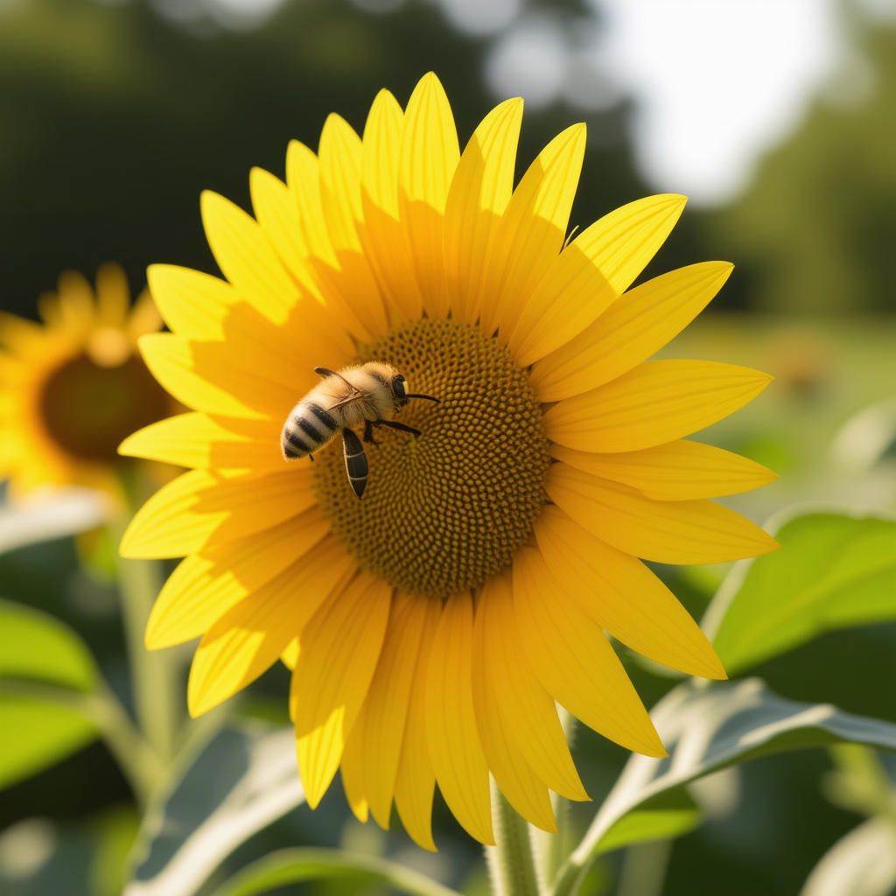
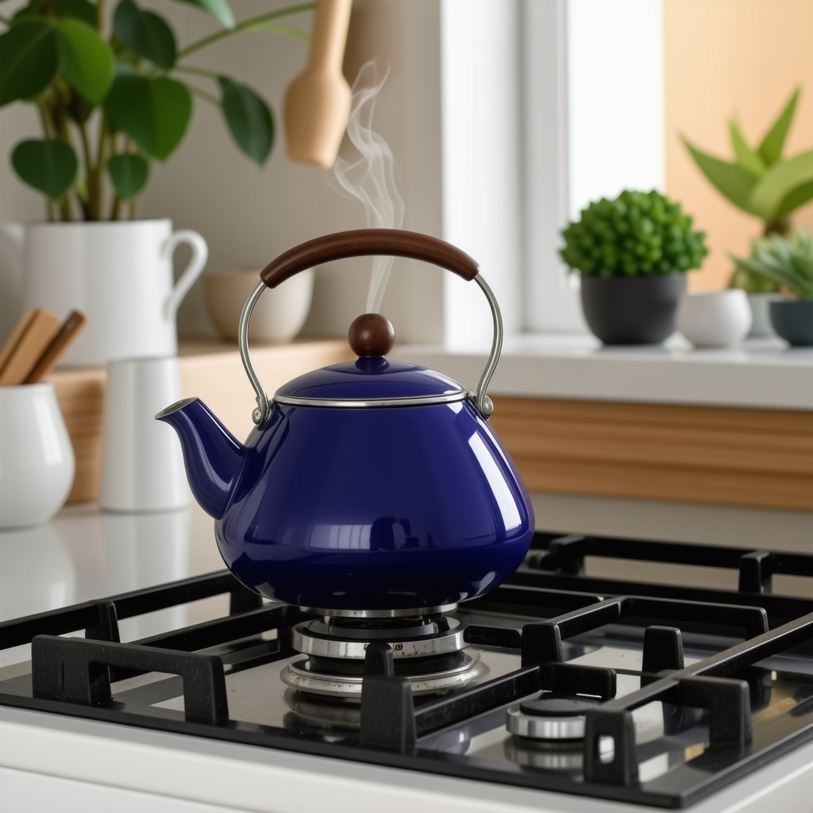
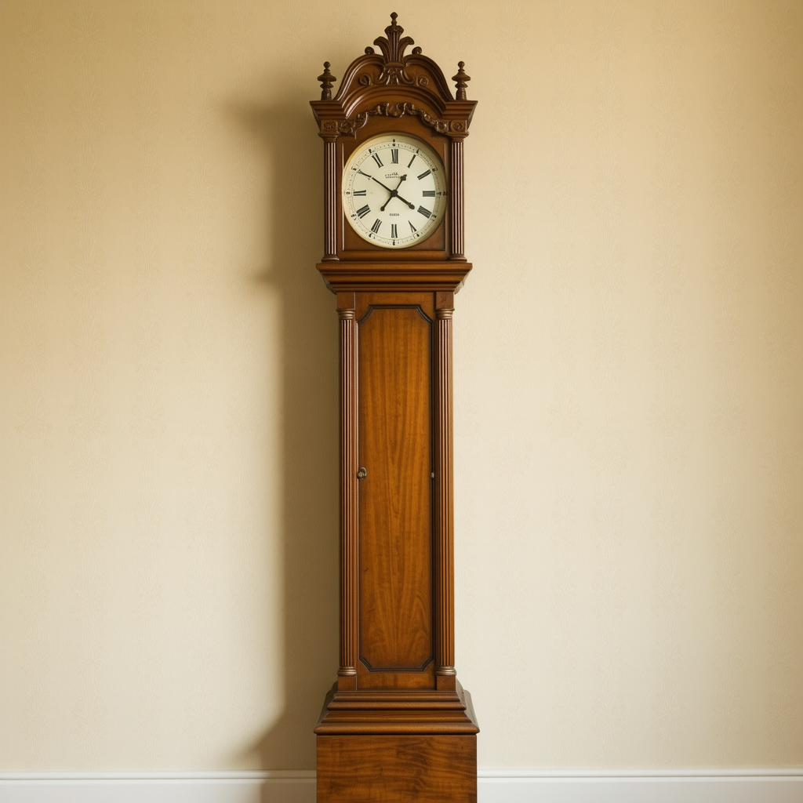
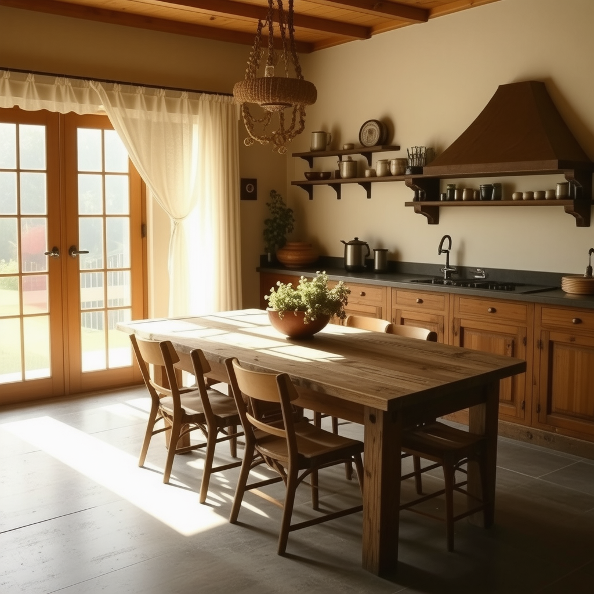

# qf5a2jvb
 scale: 0.3449003104681585, offset: 0.026480715437859972, seed: 42

# qf5a2jvb
 scale: 1.3434060730204562, offset: 0.05179752764114323, seed: 42

# qf5a2jvb
 scale: 0.6861721645798737, offset: 0.14178666614466348, seed: 42

# qf5a2jvb
 scale: 1.6456606735474415, offset: 0.17346773395485346, seed: 42

# qf5a2jvb
 scale: 1.8707633834768085, offset: 0.004929250581433498, seed: 42

# qf5a2jvb
 scale: 0.14767642036880102, offset: 0.1344508468755762, seed: 42

# qf5a2jvb
 scale: 0.9936728291122199, offset: 0.08555135455359011, seed: 42

